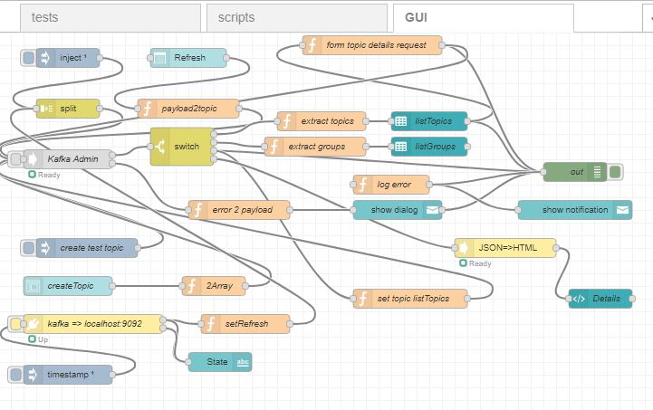
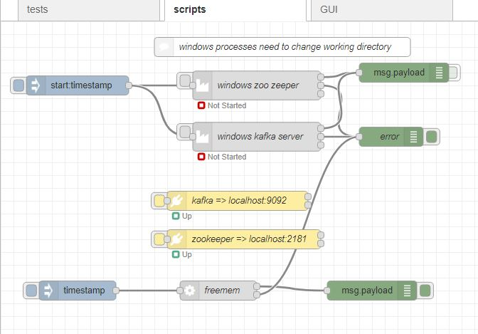

# node-red-contrib-kafka-manager
Nodes for working with apache kafka, a streaming product.
First initial release using [kafka-node][4] .

* Kafka Broker
* Kafka Admin
* Kafka Consumer
* Kafka Producer

## To Do

* sign-on connection
* Multi topic 
* add HighLevelProducer, ProducerStream, ConsumerStream, ConsumerGroup,ConsumerGroupStream and Offset

------------------------------------------------------------

## Kafka Broker

Defines the client interface to kafka. 

------------------------------------------------------------

## Kafka Admin

Provide the ability to process administration tasks such as create and list topic. 

------------------------------------------------------------

## Kafka Consumer

Consumer of topic messages in kafka which are generated into node-red message. 

------------------------------------------------------------

## Kafka Producer

Converts a node-red message into a kafka messages. 

------------------------------------------------------------

## Simple Web Admin Panel

Simple Web page monitor and admin panel 

Producing flow can be found in test flow

------------------------------------------------------------

# Install

Run the following command in the root directory of your Node-RED install or via GUI install

    npm install node-red-contrib-kafka-manager

## Dependencies

Run the following command to install [kafka-node][4]

    npm install kafka-node

# Tests

Test/example flow in test/generalTest.json

Includes sample script for start kafka in windows using node-red

------------------------------------------------------------

# Version

0.0.1 base

# Author

[Peter Prib][3]

[1]: http://nodered.org "node-red home page"

[2]: https://www.npmjs.com/package/node-red-contrib-kafka-manager "source code"

[3]: https://github.com/peterprib "base github"

[4]: https://github.com/SOHU-Co/kafka-node "npm kafka-node"
