# [node-red-contrib-kafka-manager][2]
[Node Red][1] for working with apache kafka, a streaming product.
First initial release using [kafka-node][4] .

* Kafka Broker
* Kafka Admin
* Kafka Commit
* Kafka Consumer
* Kafka ConsumerGroup
* Kafka Offset
* Kafka Producer
* Kafka Rollback

Has a test GUI which allows topics to be added.

Special features:
* Generic topic(s) for a consumer using regex which dynamically adds new topics as they are defined
* For consumer add/remove topics (not persisted)
* Convert "/" to "." to assist with interfaces to other queueing technologies

Note: all nodes run in debug mode for 111 messages then turns off.

------------------------------------------------------------

## Kafka Broker

Defines the client interface to kafka. One can add process.env for hosts with 

	process.env.atesthosts='[{"host":"atesthost1","port":1234},{"host":"atesthost2","port":4321}]';

in settings.js

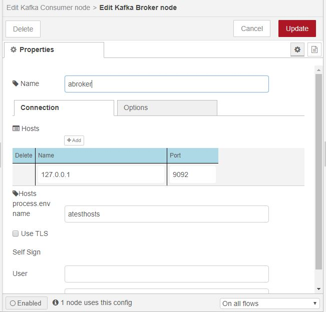
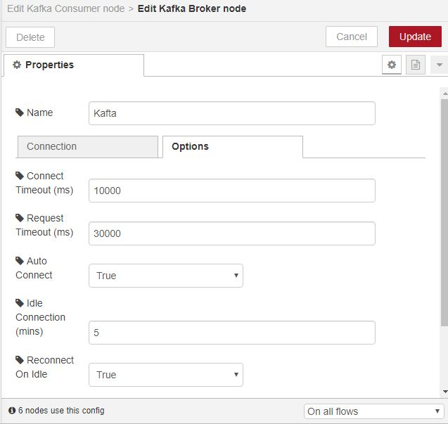

------------------------------------------------------------

## Kafka Admin

Provide the ability to process administration tasks such as create and list topic. 

Following topics commnads or via GUI allowed:

*   describeCluster
*   describeDelegationToken
*   describeReplicaLogDirs
*   listConsumerGroups
*   listGroups
*   listTopics

Plus following topics commands allowed where paramaters are payload:
*   alterConfigs, alterReplicaLogDirs, createAcls,createDelegationToke
*   createPartitions, createTopics, deleteAcls, deleteConsumerGroups, deleteRecords
*   deleteTopics, describeAcls, describeConsumerGroups, describeGroups, describeLogDirs, describeTopics   *   electPreferredLeaders, expireDelegationToken, incrementalAlterConfigs, listConsumerGroupOffsets, renewDelegationToken

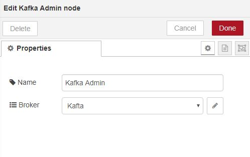

------------------------------------------------------------

## Kafka Commit

If msg._kafka exists and the consumer associated with the message is not on autocommit, it issues commit for the consumer that had produced the message.  Sends to OK or Error port depending on state.
Note, as Kakfa keeps giving messages to consumer regardless if commit being outstanding, the commit may commit many in-flight messages.  Haven't identified a method of readily preventing this behavour without complications.

------------------------------------------------------------

## Kafka Consumer

Consumer of topic messages in kafka which are generated into node-red message. 
Provides types of base and high level.
If wildcard selected then topics are regex patterns which are dynamically made active (or removed) when available.
A check is performed once every minute for chanaes to topics.

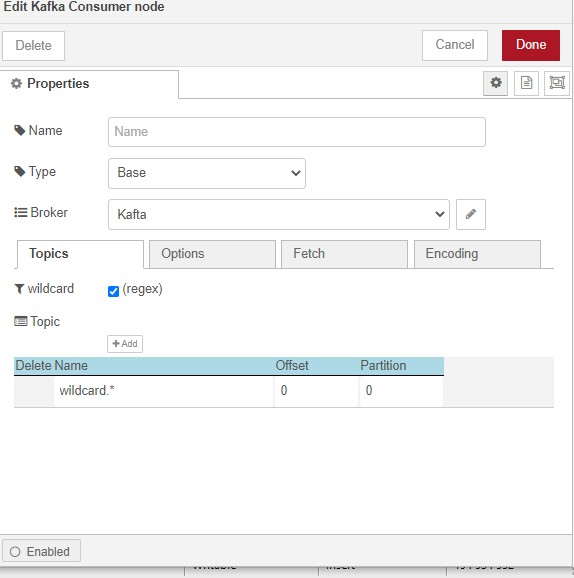
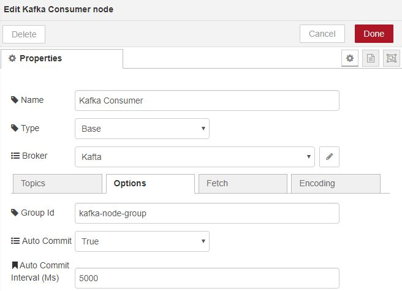
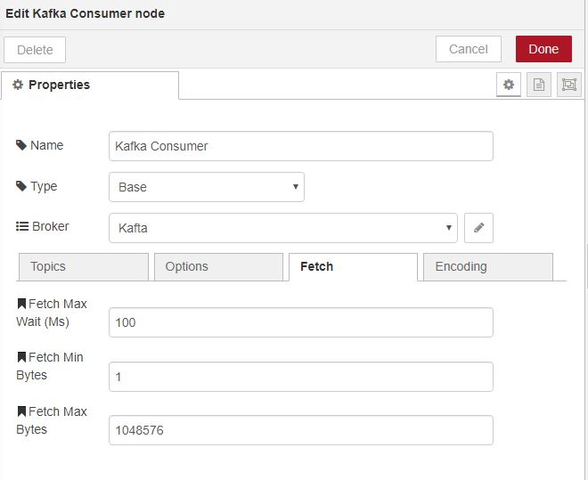
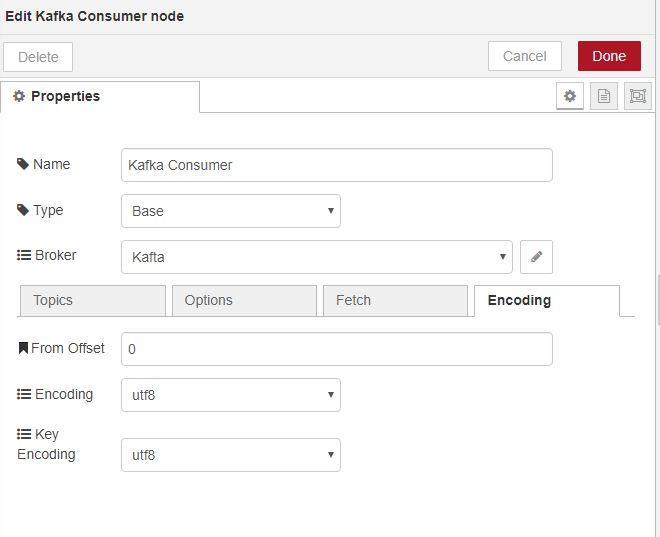
------------------------------------------------------------

## Kafka Consumer Group

Consumer of topic messages in kafka which are generated into node-red message. 

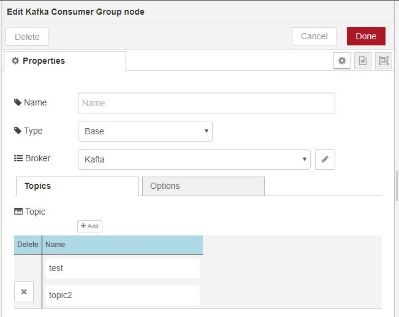
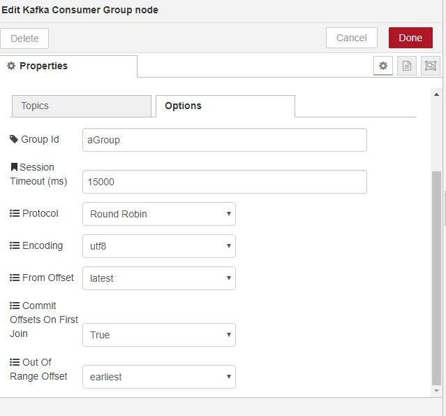

------------------------------------------------------------

## Kafka Offset

Get various offsets from Kafka. Which type are set via msg.action or msg.topic.  msg.payload states the types of options.

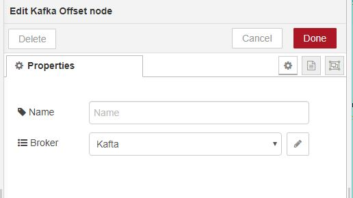

------------------------------------------------------------

## Kafka Producer

Converts a node-red message into a kafka messages.
Provides types of base and high level.

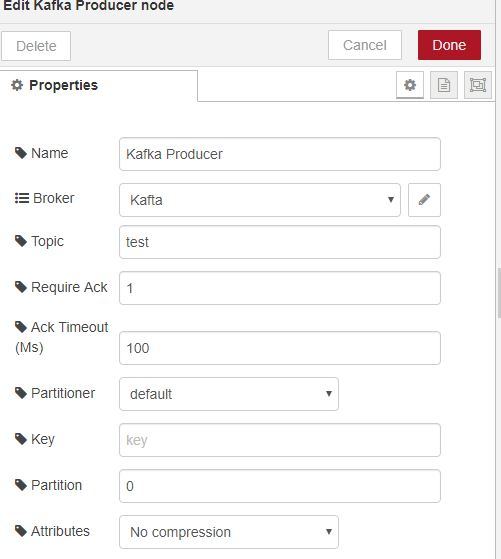

------------------------------------------------------------

## Kafka Rollback

If msg._kafka exists and the consumer associated with the message is not on autocommit, it closes the consumer.  This effectively rolls back the message in Kafka plus ensures the message cannot be automatically handed to the the consumer.  It is expected that the message or problem is fixed and the consumer opened again for processing.

------------------------------------------------------------

## Simple Web Admin Panel

Simple Web page monitor and admin panel 

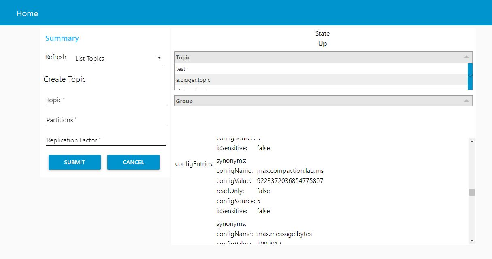

------------------------------------------------------------

# Install

Run the following command in the root directory of your Node-RED install or via GUI install

    npm install node-red-contrib-kafka-manager

# Tests

Test/example flow in test/generalTest.json

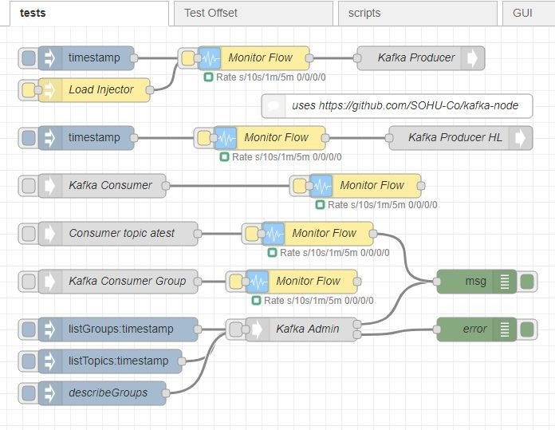

------------------------------------------------------------

# Version

0.5.0 add consumer wildcard topics + topics / to . along with fix on to/from/json

0.4.3 add convert message payload to/from json and add some basic tests

0.4.1 minor fixes

0.4.0 Add commit and rollback with ability to close and start consumer.

0.3.1 Add hosts list by process.env

0.2.14 Add self serve TLS and fix bug plus mask ssl info when debug logging

0.2.9 Change debugging mechanism and add kafka-node to dependencies

0.2.8 Added all admin api's per Kafka 2.3 but dependent on [kafka-node][4] update.
Remove refresh metadata, automated if problem.  Fix consumer group errors.  Add tests for admin calls.

0.2.7 If offsetOutOfRange pause consumer.  Added in deleteTopics but dependant on [kafka-node][4] update.

0.2.6 More fixes for error processing on invalid topic

0.2.4 Fix for error processing

0.2.3 Fix for multi nodes on broker

0.2.2 Stopped bug where producer on connection initiates a null message. Fix bug with restart logic on fail and order of messages on failed retry

0.2.1 When messages being queued as producer is waiting on connection or reconnection show producer in problem state.

0.2.0 Add nodes consumer group and offset.
	Another fix to issue with initial no kafka.
	describe groups implemented

0.1.0 Add in High level producer/consumer.
  	Further fixes to make connection more robust on kafka up/down
  	Multi host per broker
  	Multi Topic for consumer

0.0.1 base

# Author

[Peter Prib][3]

[1]: http://nodered.org "node-red home page"

[2]: https://www.npmjs.com/package/node-red-contrib-kafka-manager "source code"

[3]: https://github.com/peterprib "base github"

[4]: https://github.com/SOHU-Co/kafka-node "npm kafka-node"
